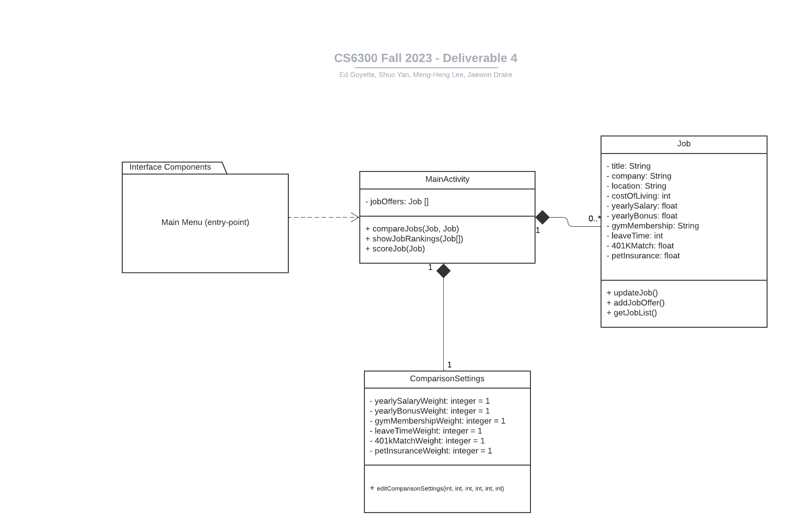

# Design Discussion

## Section I - Individual Designs

### Design 1:


* **Pros:**
```
  1) The design is clean and comprehensive, addressing most of the requirements outlined in the documentation.
  2) Relationships between classes are clearly delineated and well-represented.
  3) The chosen interface components align well with the UI design requirements.
```

* **Cons:**
```
  1) The design lacks detailed specifications such as visibility for attributes, return types for operations, and argument types for functions, which could enhance clarity and understanding.
  2) The Interface Components section could benefit from more explicit descriptions, especially regarding user interactions and the relationships between interface elements and underlying classes.
  3) The Application class might need further refinement, such as the potential addition of the `jobRank` method and other helper functions to improve efficiency and clarity.
```


### Design 2:


* **Pros:**
```
  1) The design is clean with an appropriate number of classes, which ensures the simplicity and manageability.
  2) Relationships between classes are clearly and effectively providing a clear understanding of the system's structure.
  3) The hierarchical structure, with `JobOffer` and `CurrentJob` as subclasses of `Job`, offers a logical organization of job-related entities.
```

* **Cons:**
```
  1) The design would be enhanced with further details, particularly regarding the visibility, argument types, and return types for both methods and attributes.
  2) For score calculations, incorporating a `score` method within the `Job` class seems more efficient. An additional box dedicated to job score calculation may be redundant.
```

### Design 3:


* **Pros:**
```
  1) The design features an appropriate number of classes with clear relationships between them. The attributes and operations within each class align well with the assignment requirements.
  2) The inclusion of visibility for attributes and methods enhances the design's clarity and comprehensibility.
  3) The use of `JobOffer` and `CurrentJob` as subclasses of `Job` provides a logical structure for organizing job-related entities.
```

* **Cons:**
```
  1) Specifying argument types and return types for methods would increase the reliability and clarity of the design.
  2) The visibility settings for some classes appear reversed. Typically, methods have public visibility, while attributes are set to private.
  3) Class names should avoid spaces for better readability and convention. For instance, 'Main Compare App' should be formatted as 'MainCompareApp'.
```

### Design 4:


* **Pros:**
```
  1) The design is clean and streamlined, featuring an appropriate number of classes with well-defined relationships. This clarity makes it easy for readers to grasp the design's logic.
  2) Multiplicities are highlighted, aiding in a clearer understanding of the relationships between classes.
  3) The detailed attributes and operations as well as visibility for each class align well with the requirements outlined in the documentation.
```

* **Cons:**
```
1) It might be better to introduce interface components, a significant aspect of the design requirement, would enhance user comprehension of the design.
2) The design is somewhat overly detailed. There's no necessity to enumerate all frontend tasks in the class diagram. Additionally, some operations within the class appear redundant.
```

## Section II - Team Design


```
- We believe that the design we came up with is the most optimal one, and at the same time integrated the essence from each of the members’ designs. First of all, through discussion, we think that the attributes of each class should not change. Therefore the attributes are basically the same. However, one change that we made, taking reference from Design 3, is that we added a jobScore attribute to calculate the score of an input job on the fly. This newly added attribute allows our system to print out the rank of the job list by simply sorting the job list in regard to their score attribute. It can also help check if the job list is empty or not.
- As shown in Designs 2 and 3, the authors further separate the Job class into a job offer and current job. We decided to eliminate those since all of the attributes from both classes are the same. It is just a matter of how the system uses them. So we did not have any inherent classes in our final design.
- Additionally, in order to accommodate the function of comparing two jobs and the whole list. We also added two methods separately in the Application class. Where both of the methods utilize the jobScore from Job class.
- We noticed that the design of weight setting class in Design 2 is essential for our final UML diagram, since it should be considering the case that non of the weights are being assigned. Therefore, we compied the default setting from Design 2, where the default weights are all set to 1, making sure all the factors are equal.
```

## Section III - Summary
As a team, we found out the there are multiple ways and methodologies for designing systems. We looked at the pros of cons of each individual design and saw a clear difference in the number of details we either included or omitted. For the more detailed designs, we incorporated ideas into our final design that we found essential in the user experience (such as the interface components that show the entry-point and necessary front-end components). We learned that every design had important pieces that we could learn from and base our final design on. We did all this in a systematic way in a Zoom meeting by first listing out essential classes from everyone's design and then refining multiple times until we had a design everyone agreed on.
