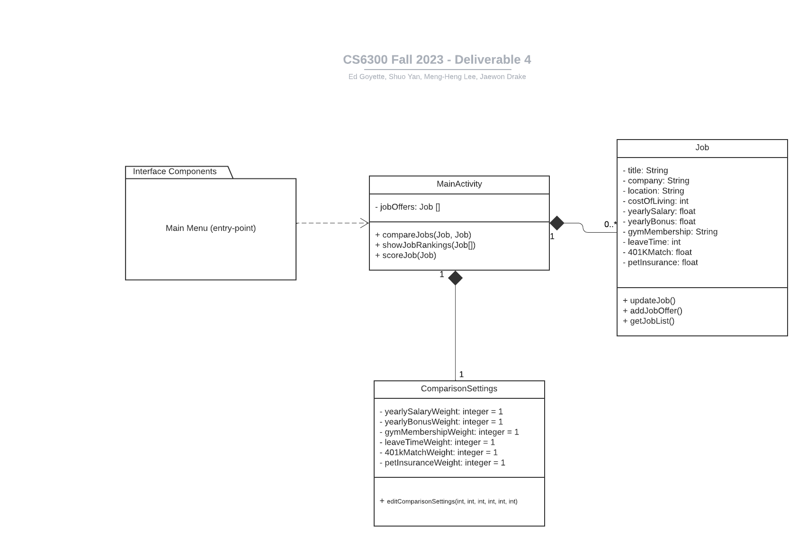

# Design Document V0

**Author**: \<6300Fall23Team144\>

## 1 Design Considerations

### 1.1 Assumptions

- We may use Slack for communication and any other means to communicate remotely to complete it.
- We may use an emulator or physical hardware to test and showcase the completed application during and after development.
- All our development tools and hardware will be in operational order throughout the project.
- Our incurred costs will remain zero throughout the project. No purchases will be necessary to complete the project.
- The application will remain in the scope of the given requirements throughout the development period.

### 1.2 Constraints

- Technical constraints: our app is constrained to the available resources each team member has. Although physical hardware that runs Android is not required to build this app, the emulator poses a technical constraint in that we cannot test it on physical hardware unless a team member has an Android phone. Even then, there are numerous Android devices in existance that we cannot account for.
- Team member constraints: each team member is a student and some of us have jobs. This introduces a time constraint that can affect the final outcome of the project.

### 1.3 System Environment

- The system requires a device capable of running the Android operating system.
    - This can either be an emulator or actual physical hardware.

## 2 Architectural Design

### 2.1 Component Diagram

- This project relies on a singular component that drives the system. The component is described in detail in [Section 3.1](#31-class-diagram) below.

### 2.2 Deployment Diagram

- This project relies on a singular hardware device capable of running the Android operating system. Therefore, there will be no interactions with external systems and we have decided not to show a deployment diagram.

## 3 Low-Level Design

### 3.1 Class Diagram

- Our UML class diagram showcases each class and relationship as well as methods and visibility of those methods. Over several iterations, we extracted the most essential classes and attributes to satisfy the requirements for the user.
