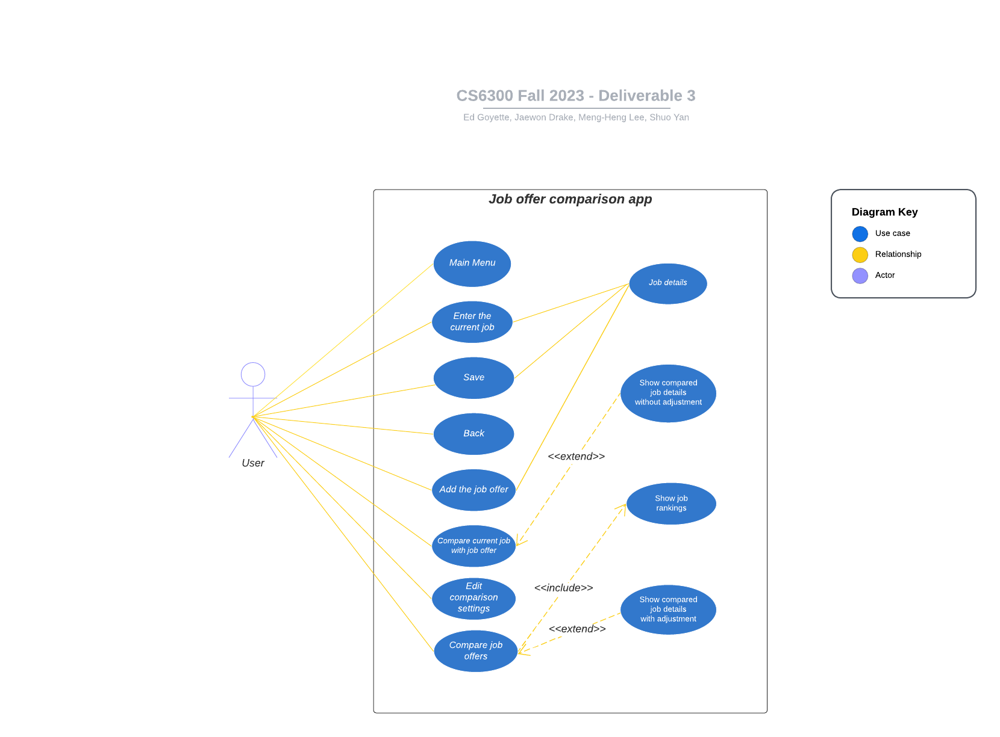

# Use Case Model V1

**Author**: \<6300Fall23Team144\>

## 1. Use Case Diagram

## 2. Use Case Description: Job Offer Comparison App

**Requirements**:
- This use case allows the user enter and edit the current job.
- The user can add several job offers and view the job list rankings based on user-defined comparison settings.
- The user can compare any two jobs from the list, including their current job.

**Pre-conditions**:
- The app is opened.
- At least two jobs are entered (current job or job offers).

**Post-conditions**:
- User is shown a comparison between selected jobs.
- All entered job details (current job and job offers) are saved in the system for future use.

**Scenarios**:
1. User opens the app, and the main menu is presented.
2. If the user hasn't entered their current job details:
   - User selects to enter the current job and inputs the details.
   - User saves the current job input.
   - User returns to the main menu.
3. User selects to enter a job offer and inputs the details.
4. User saves the job offer with a user-defined name.
5. User has the option to:
   - Enter another job offer.
   - Adjust the comparison settings.
   - Compare job offer with current job (if applicable).
6. If the user chooses to compare job offers:
   - User is presented with a list of job offers, including their current job.
   - User selects two jobs from the list to compare.
   - User is shown a detailed comparison between the two selected jobs.
7. User can return to the main menu at any point.
8. User exits the app.
